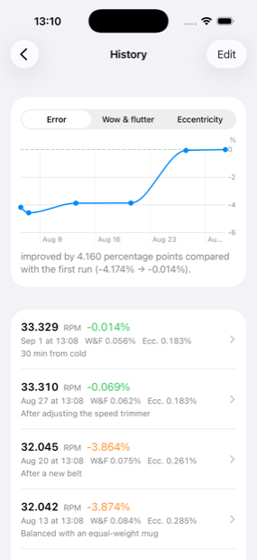

# TurntableRPM

**English** · [繁體中文](README.zh-TW.md)

[](https://github.com/RogerH0711/TurntableRPM/actions/workflows/swift.yml)

Measure a turntable's speed and wow & flutter with an iPhone, targeting 0.1% accuracy.
Put the phone on the spinning platter — no strobe disc, no extra hardware.

It started with a Thorens TD 235 EV that had sat idle for 20 years and ran slow. Diagnosing
that needed a tool accurate to 0.1%.

## What it tells you

- **Mean speed and error %** — whether the platter runs fast or slow, and by how much
- **Wow & flutter**, IEC 386 / DIN 45507 weighted WRMS, directly comparable to the
  factory spec
- **Spectral peak interpretation** — the main thing that sets this apart from other RPM
  apps. Integer multiples of platter rotation mean something turning *with* the platter
  (eccentricity, an out-of-round platter); non-integer ones mean a part of the drive chain
  running at a different speed (motor, pulley). Enter your drive-chain dimensions and it
  will point at a peak and say *that one is the motor*.
- **Polar heatmap** — which part of the platter the error concentrates on
- **History and trend chart** — compare directly before and after an adjustment
- **Raw data export** — per-sample JSON, for use with `tools/analyze_export.py`

While measuring, the screen **counter-rotates**, so the content looks stationary as the
platter turns and you can read it without picking the phone up.

<p align="center">
  
  
  
</p>

<p align="center"><sub>Analysis · History &amp; trend · Phone placement.<br>
Simulator screenshots; the data is a synthetic signal for demonstration.</sub></p>

## What it cannot see

**The phone turns with the platter, so what it measures is the platter's speed.** Pitch
variation caused by an off-center record hole is completely invisible to this method — and
in practice that is often the largest part of the wow you actually hear.

**Until you calibrate, the "error %" cannot be used to adjust your deck.** It is the
turntable's error multiplied by the gyroscope's error, and the two cannot be separated.
Calibration uses a stopwatch — once per phone is enough.

## Requirements

- iPhone, iOS 17 or later (iPad is not supported)
- Interface languages: **English / 繁體中文 / 日本語 / Deutsch** (follows your system setting)
- A platter large enough for the phone; 16⅔ / 33⅓ / 45 / 78 RPM are all supported
- Development needs macOS, Xcode 16+, and [XcodeGen](https://github.com/yonaskolb/XcodeGen)

## Installing

### Option A: build it yourself in Xcode (recommended)

Most reliable, and you don't have to trust a third-party tool. See **Building** below.

### Option B: download the .ipa and sign it yourself

[Releases](https://github.com/RogerH0711/TurntableRPM/releases) has `TurntableRPM-unsigned.ipa`.

**It is unsigned and cannot be installed directly.** iOS only runs signed apps, and I do
not have a paid developer account, so there is no TestFlight build and no ready-to-install
version. You have to sign it with **your own Apple ID**; the usual tools are
[AltStore](https://altstore.io) or [SideStore](https://sidestore.io):

1. Install **AltServer** on a Mac or Windows PC
2. Connect the iPhone and use AltServer to install **AltStore** on it
3. Download the `.ipa` above to the iPhone
4. Open AltStore ▸ My Apps ▸ **+** (top left) ▸ pick the `.ipa`
5. Enter your Apple ID (a separate one is recommended — don't use your main account)

**Limits of a free Apple ID:**

- The app **expires after 7 days** and has to be re-signed (AltStore renews it
  automatically on the same Wi-Fi)
- At most **3** apps installed this way at a time

With a paid developer account ($99/year) signatures last a year. Once I have one this will
move to TestFlight, and installing will be a single link.

## Building

```sh
brew install xcodegen
git clone https://github.com/RogerH0711/TurntableRPM.git
cd TurntableRPM
make setup
make open
```

In Xcode, select the TurntableRPM target ▸ Signing & Capabilities ▸ Team, choose your Apple
ID, then put the Team ID in `Config/Local.xcconfig` (that file is not in version control,
so `make generate` will not overwrite it).

Enable Developer Mode on the iPhone first: Settings ▸ Privacy & Security ▸ Developer Mode.
A free Apple ID's signature expires after 7 days — just ⌘R again when it does.

| Command | What it does |
|---|---|
| `make test` | Algorithm tests (97 of them, about 4 s; no simulator or device needed) |
| `make generate` | **Required** after adding or deleting files under `App/` |
| `make open` | Generate the project and open Xcode |
| `make doctor` | Environment self-check |
| `make reference` | Run the Python reference implementation, regenerating golden vectors |
| `make android-test` | Kotlin core tests on the JVM (no phone needed) |
| `make android-apk` | Build the debug APK |

## Architecture

```
Packages/TurntableCore/   Algorithm core. Plain Swift + Foundation
  Sources/                  imports neither UIKit nor CoreMotion
  Tests/                    97 tests
  Reference/                Python reference implementation — source of the golden values
App/                      The only layer that touches CoreMotion / SwiftUI / SwiftData
  Localizable.xcstrings     306 strings in four languages
android/                  Kotlin port (shares the same golden vectors)
  core/                     plain Kotlin, JVM tests, no Android framework
  app/                      the only layer that touches SensorManager
tools/analyze_export.py   Analyzes exported measurement JSON
docs/spec.md              Technical specification
```

**Separating the core from the platform is deliberate**: the Simulator has no gyroscope, so
anything sensor-related has to be tested on a real device. Extracting the algorithms into
plain Swift with no iOS framework dependencies lets the tests run natively on macOS and in
a Linux container — which is what makes CI meaningful.

**Golden values come from the independent Python implementation in `Reference/`**, not from
Swift's own output. Changing an algorithm means changing the Python first, confirming the
maths, then porting to Swift. CI blocks the two from drifting apart.

`.xcodeproj` is generated by XcodeGen from `project.yml` and is **not in version control**,
which avoids merge conflicts in the project file.

## Android port (in progress)

`android/` holds a Kotlin port that shares the **same golden vectors** as the Swift core.
`android/core` is plain Kotlin with no Android framework dependency, and its tests read
`Packages/TurntableCore/Reference/golden.json` directly — all nine golden entries are
covered. `make android-test` runs them on the JVM; no phone needed.

### Measured sampling behaviour

Android's `SensorManager` sampling rate is only a *hint* — the real rate is decided by the
vendor's HAL. Measured on a **Sony Xperia XZ Premium** (G8142, Android 9,
STMicroelectronics LSM6DSM gyroscope), phone stationary:

| Requested | Actual | Median interval | σ | Jitter | Long gaps | Worst gap | Sensor clock ÷ wall clock |
|---|---|---|---|---|---|---|---|
| 50 Hz | 53.96 Hz | 18.524 ms | 0.014 ms | 0.075% | 0 | 1.01× | 0.99995 |
| **100 Hz** | **107.92 Hz** | **9.277 ms** | **0.015 ms** | **0.160%** | **0** | **1.00×** | **0.99995** |
| 200 Hz | 215.74 Hz | 4.639 ms | 0.076 ms | 1.641% | 4 | 1.56× | 1.00051 |
| iPhone 15 Pro Max @100 Hz | 100.13 Hz | 9.990 ms | 0.005 ms | 0.05% | 0 | 1.00× | — |

**The consistent +7.9% is two effects stacked, not noise.** The LSM6DSM's ODR ladder is
12.5/26/52/104/208 Hz — *not* 50/100/200. The HAL rounds up to the ladder, then a fixed
oscillator deviation multiplies on top:

```
53.96 ÷ 52 = 1.03769      107.92 ÷ 104 = 1.03769      215.74 ÷ 208 = 1.03721
```

The first two agree to five decimal places.

**What matters is whether the *timestamps* are honest**, not whether the rate matches the
request. If the timestamp clock ran 7.9% fast, every frequency-domain result would shift by
the same amount and the "which part is at fault" diagnosis — the most valuable thing this
app does — would be wrong. Mean speed looks identical either way (ω is a physical quantity,
independent of the sampling clock), so speed alone cannot tell you. Comparing against
`SystemClock.elapsedRealtimeNanos()` settles it: the ratio is **0.99995**, so the
timestamps are honest and the app is unaffected — because it always integrates with real
timestamps and never assumes a fixed rate.

200 Hz degrades clearly (jitter 1.641%, four long gaps, worst gap 1.56×) and this app does
not need it — above 50 Hz only 0.72% of the weighted energy remains. So it uses the 100 Hz
setting, which also sidesteps Android 12's `HIGH_SAMPLING_RATE_SENSORS` permission entirely.


## Development notes

[`CLAUDE.md`](CLAUDE.md) records 35 pitfalls hit along the way, including several that took
a long time to find (the file is in Traditional Chinese):

- `CMDeviceMotion.attitude.yaw` is a fusion result — calibrating the gyroscope against it
  is a tautology
- Moving averages belong only on the display path; used in the wow & flutter calculation
  they carve out the weighted peak at 4 Hz entirely
- A phone sitting off-center on the platter slows it down and amplifies the wobble —
  it must be counterbalanced
- A recorded measurement can itself be wrong; when independent evidence contradicts it,
  the recorded value is what needs checking

[`docs/td235ev-maintenance.md`](docs/td235ev-maintenance.md) is the service log for that
particular turntable.

## Safety

- **Remove magnetic cases and MagSafe accessories** — a magnet near an MC cartridge can
  damage it permanently
- Lock the tonearm in its rest; never leave the cartridge hanging over the platter
- Use the platter's own mat (felt, non-woven or rubber all work; no need to add a record)
  and never press the phone onto the bare platter
- **Put something the same weight as the phone opposite it** — without it the platter runs
  about 0.3% slow and the wobble is a third larger
- At 78 RPM keep the phone nearer the center: centrifugal force from off-center placement
  is 5.5× what it is at 33

## Translations

The app ships in Traditional Chinese (the source language), English, Japanese and German.
The Japanese and German translations have not yet been reviewed by a native speaker —
corrections are very welcome.

## Licence

MIT. See [LICENSE](LICENSE).
