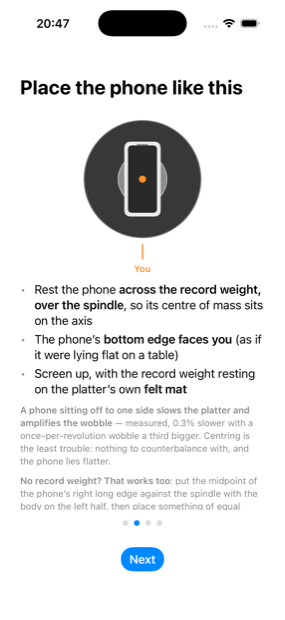
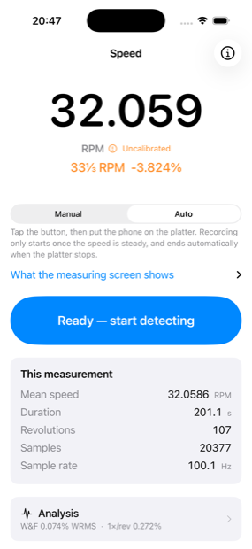
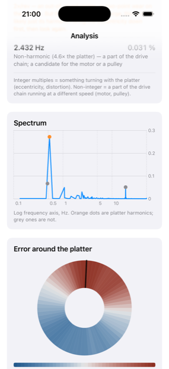
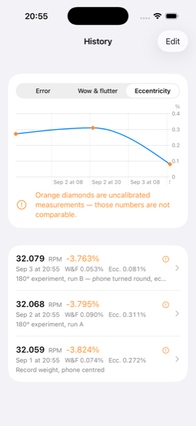
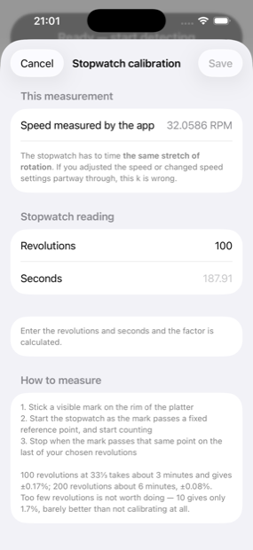
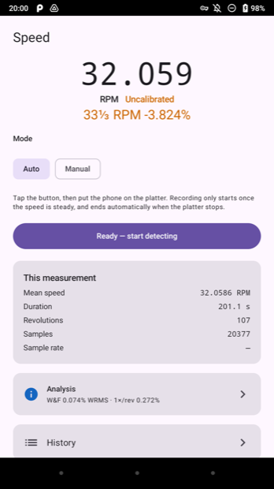
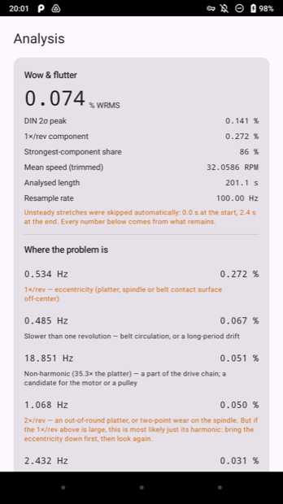
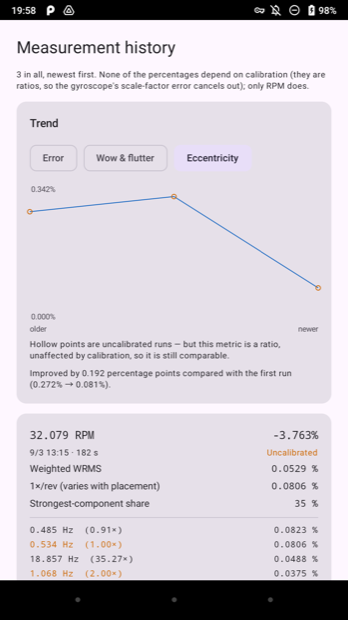

# TurntableRPM

**English** · [繁體中文](README.zh-TW.md)

[](https://github.com/RogerH0711/TurntableRPM/actions/workflows/swift.yml)
[](https://github.com/RogerH0711/TurntableRPM/actions/workflows/android.yml)

Measure a turntable's speed and wow & flutter with your phone, targeting 0.1% accuracy.
Put it on the spinning platter — no strobe disc, no extra hardware.
**iOS and Android, same algorithms, same numbers.**

It started with a Thorens TD 235 EV that had sat idle for 20 years and ran slow. Diagnosing
that needed a tool accurate to 0.1%.

<p align="center">
  
  
  
</p>

<p align="center"><sub><b>Where to put the phone · what it measured · which part is causing it.</b><br>
Real data from the Thorens TD 235 EV — 201 s, 20,377 samples.</sub></p>

<p align="center">
  
  
  
</p>

<p align="center"><sub><b>The spectrum and the platter map · how it changed · calibrating
against a stopwatch.</b><br>
The peaks are that deck's actual fingerprint: eccentricity at 1×, the belt at 0.91×, the
motor at 35.3×. In the history, the last two runs are the same deck measured twice with the
phone turned 180° in between — eccentricity drops from 0.31% to 0.08%, because most of it
was the phone, not the turntable.</sub></p>

## What it tells you

- **Mean speed and error %** — whether the platter runs fast or slow, and by how much
- **Wow & flutter**, IEC 386 / DIN 45507 weighted WRMS, directly comparable to the
  factory spec
- **Spectral peak interpretation** — the main thing that sets this apart from other RPM
  apps. Integer multiples of platter rotation mean something turning *with* the platter
  (eccentricity, an out-of-round platter); non-integer ones mean a part of the drive chain
  running at a different speed (motor, pulley). Enter your drive-chain dimensions and it
  will point at a peak and say *that one is the motor*.
- **Polar heatmap** — which part of the platter the error concentrates on
- **History and trend chart** — compare directly before and after an adjustment
- **Raw data export** — per-sample JSON, for use with `tools/analyze_export.py`

While measuring, the screen **counter-rotates**, so the content looks stationary as the
platter turns and you can read it without picking the phone up.

## What it cannot see

**The phone turns with the platter, so what it measures is the platter's speed.** Pitch
variation caused by an off-center record hole is completely invisible to this method — and
in practice that is often the largest part of the wow you actually hear.

**Until you calibrate, the "error %" cannot be used to adjust your deck.** It is the
turntable's error multiplied by the gyroscope's error, and the two cannot be separated.
Calibration uses a stopwatch — once per phone is enough.

## Using it

1. **Balance the phone about the spindle.** Easiest is to rest it across a record weight so
   its centre of mass sits on the axis. Off-centre, the deck runs about 0.3% slow and the
   reported wobble is a third larger — see [Safety](#safety).
2. **Stop the platter, put the phone down, tap Start.** In automatic mode it waits for the
   speed to settle before it begins recording, and stops on its own when the platter does.
3. **Let it run at least 90 seconds** — the spectrum's resolution is 1 ÷ measurement length.
   Three minutes if you want accurate peak amplitudes; a one-minute run underestimates them
   by about 8%.
4. **Read the analysis.** Mean speed and error % say whether the deck runs true; the
   spectral peaks say which part is responsible.

To trust the error %, calibrate once with a stopwatch: mark the platter, time 100
revolutions, and enter the numbers. Wow & flutter and the other percentages are ratios and
need no calibration.

## Get it

### Android — download the APK

[**Latest release**](https://github.com/RogerH0711/TurntableRPM/releases/latest) ▸
`TurntableRPM-*.apk`. Open it on the phone; the first time, Android will ask whether to
allow installs from that source. Signed, 2.7 MB.

Needs **Android 9 or later** and — this is the real constraint — **a gyroscope**. Not every
Android phone has one; mid-range models often omit it, and the app says so plainly on launch
if yours doesn't. See [`docs/android-sensors.md`](docs/android-sensors.md).

<p align="center">
  
  
  
</p>

<p align="center"><sub>The same recording on Android — same layout, same numbers, native
controls on each platform.</sub></p>

### iOS — build it or sign it yourself

There is no App Store build: that needs a paid developer account, which this project does
not have.

**Build it in Xcode** (most reliable) — see [Building](#building) below.

**Or sign the `.ipa` yourself.** [Releases](https://github.com/RogerH0711/TurntableRPM/releases)
has `TurntableRPM-unsigned.ipa`. iOS only runs signed apps, so you must sign it with **your
own Apple ID** using [AltStore](https://altstore.io) or [SideStore](https://sidestore.io):

1. Install **AltServer** on a Mac or Windows PC
2. Connect the iPhone and use AltServer to install **AltStore** on it
3. Download the `.ipa` to the iPhone
4. AltStore ▸ My Apps ▸ **+** ▸ pick the `.ipa`
5. Enter your Apple ID (a secondary one is advisable)

With a free Apple ID the app **expires after 7 days** and you can have at most **3** such
apps installed. AltStore renews automatically on the same Wi-Fi. A paid account ($99/year)
gives a year.

## Requirements

| | Android | iOS |
|---|---|---|
| OS | 9 or later | 17 or later (no iPad) |
| Hardware | **Gyroscope required** | Any iPhone |
| Interface | English / 繁體中文 / 日本語 / Deutsch, follows the system setting | same |
| Speeds | 16⅔ / 33⅓ / 45 / 78 RPM | same |

Development needs macOS + Xcode 16 for iOS; Android Studio (or just a JDK) for Android.

## Building

```sh
git clone https://github.com/RogerH0711/TurntableRPM.git
cd TurntableRPM
```

| Command | What it does |
|---|---|
| `make test` | Swift algorithm tests (99, ~4 s, no simulator or device needed) |
| `make android-test` | Kotlin tests (92 core + 17 app, JVM, no phone needed) |
| `make android-apk` | Debug APK |
| `make android-release` | Signed release APK — see [`docs/android-release.md`](docs/android-release.md) |
| `make android-strings` | Regenerate the four `strings.xml` from `android/tools/strings_catalog.json` |
| `make open` | Generate and open the Xcode project |
| `make generate` | **Required** after adding or removing files under `App/` |
| `make doctor` | Environment self-check |
| `make reference` | Run the Python reference implementation, regenerating the golden vectors |

For iOS you also need [XcodeGen](https://github.com/yonaskolb/XcodeGen) (`brew install
xcodegen`), then in Xcode pick your Apple ID under Signing & Capabilities and put the Team
ID in `Config/Local.xcconfig` (not in version control, so `make generate` won't wipe it).
Enable Developer Mode on the iPhone: Settings ▸ Privacy & Security ▸ Developer Mode. A free
Apple ID's signature expires after 7 days — ⌘R again to reinstall.

## Architecture

```
Packages/TurntableCore/   Algorithm core. Plain Swift + Foundation
  Sources/                  imports neither UIKit nor CoreMotion
  Tests/                    99 tests
  Reference/                Python reference implementation — source of the golden vectors
App/                      The only layer touching CoreMotion / SwiftUI / SwiftData
  Localizable.xcstrings     312 strings, four languages
android/
  core/                     Plain Kotlin, JVM tests, no Android framework dependency
  app/                      The only layer touching SensorManager
  tools/strings_catalog.json  353 strings, four languages — generates the strings.xml files
tools/analyze_export.py   Analyses exported measurement JSON
docs/spec.md              Technical specification
```

**Separating the core from the platform is deliberate.** Simulators have no gyroscope, so
anything sensor-related must be tested on real hardware. Pulling the algorithms out into
plain Swift (and plain Kotlin) lets the tests run on macOS, in a Linux container, and on the
JVM — which is what makes CI meaningful.

**The golden vectors come from the independent Python implementation in `Reference/`**, not
from Swift's own output. Changing an algorithm means changing Python first, confirming the
maths, then porting. CI fails if the two drift apart.

The `.xcodeproj` is generated by XcodeGen from `project.yml` and is **not** in version
control, which avoids merge conflicts in the project file.

## Two implementations, one core

Synthetic golden vectors check that the maths matches the spec. This checks something
stronger: that **two independent implementations reach the same conclusion about the same
physical recording**. Feeding a 20,377-sample export from the iOS app (203 s on a Thorens
TD 235 EV) through the Kotlin core:

| | Kotlin | Swift | Difference |
|---|---|---|---|
| Mean speed | 32.05861 RPM | 32.05861 RPM | 0.0000% |
| Rotation frequency | 0.53431 Hz | 0.53431 Hz | 0.0000% |
| Weighted WRMS | 0.07436% | 0.07436% | 0.0000% |
| DIN 2σ peak | 0.14126% | 0.14125% | 0.0018% |
| 1×/rev component | 0.27238% | 0.27238% | 0.0001% |

The Kotlin port also reproduces the deck's fingerprint: eccentricity at 1×, the belt at
0.908×, and the motor at 35.28×.

Exports are not in version control (~2 MB each), so this is a manual tool rather than an
automatic test:

```sh
make android-crosscheck FILE=TurntableRPM-20260901-155337.json
```

## Development notes

[`CLAUDE.md`](CLAUDE.md) records 45 pitfalls hit along the way, including several that took
a long time to find (the file is in Traditional Chinese):

- `CMDeviceMotion.attitude.yaw` is a fusion result — calibrating the gyroscope against it
  is a tautology
- Moving averages belong only on the display path; used in the wow & flutter calculation
  they carve out the weighted peak at 4 Hz entirely
- A phone sitting off-center on the platter slows it down and amplifies the wobble —
  it must be counterbalanced
- A recorded measurement can itself be wrong; when independent evidence contradicts it,
  the recorded value is what needs checking

[`docs/td235ev-maintenance.md`](docs/td235ev-maintenance.md) is the service log for that
particular turntable.

[`docs/android-sensors.md`](docs/android-sensors.md) covers what the Android port measured
about sensor timing — the sampling rate that is 7.9% above what was requested, and why that
turned out to be harmless.

## Safety

- **Remove magnetic cases and MagSafe accessories** — a magnet near an MC cartridge can
  damage it permanently
- Lock the tonearm in its rest; never leave the cartridge hanging over the platter
- Use the platter's own mat (felt, non-woven or rubber all work; no need to add a record)
  and never press the phone onto the bare platter
- **Balance the phone about the spindle.** Easiest is to rest it across a record weight so
  its centre of mass sits on the axis; otherwise put something of equal weight opposite it.
  Off-centre, the platter runs about 0.3% slow and the once-per-revolution wobble is a third
  larger. Measured on this deck, **most of the reported 1×/rev came from the phone, not the
  turntable** — to find out how much, measure, rotate the phone 180°, and measure again
- At 78 RPM keep the phone nearer the center: centrifugal force from off-center placement
  is 5.5× what it is at 33

## Translations

The app ships in Traditional Chinese (the source language), English, Japanese and German.
The Japanese and German translations have not yet been reviewed by a native speaker —
corrections are very welcome.

## Licence

MIT. See [LICENSE](LICENSE).
