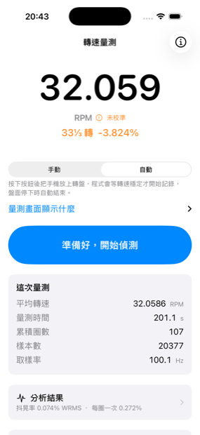
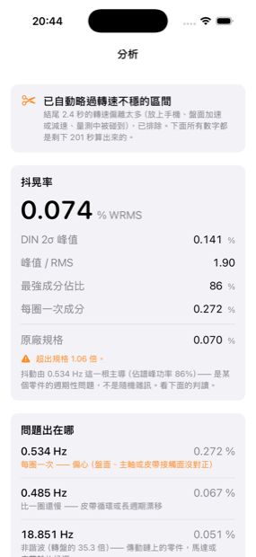
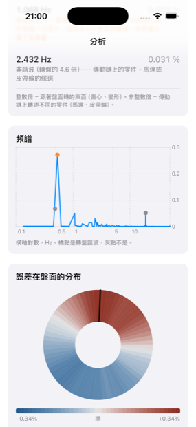
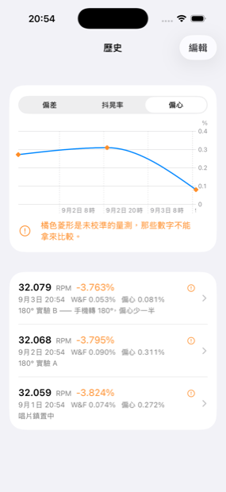
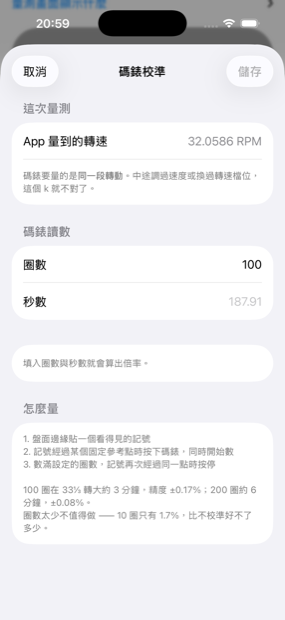
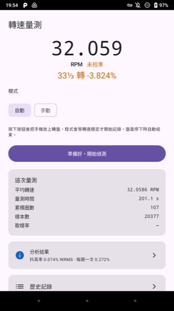
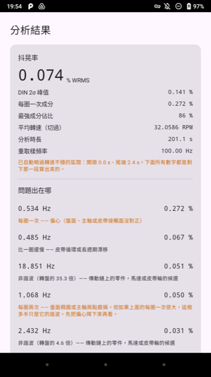
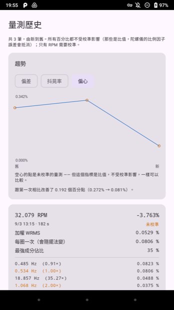

# TurntableRPM

[English](README.md) · **繁體中文**

[](https://github.com/RogerH0711/TurntableRPM/actions/workflows/swift.yml)
[](https://github.com/RogerH0711/TurntableRPM/actions/workflows/android.yml)

用手機量測黑膠唱盤的轉速與抖晃率（wow & flutter）。目標精度 0.1%。
把手機放在轉動的盤面上就能量，不需要頻閃盤或其他硬體。
**iOS 與 Android 兩版共用同一套演算法，算出同樣的數字。**

起因是一台閒置 20 年的 Thorens TD 235 EV 轉速偏慢，需要一個能量到 0.1% 的工具來診斷。

<p align="center">
  
  
  
</p>

<p align="center"><sub><b>手機怎麼擺 · 量到什麼 · 是哪個零件造成的。</b><br>
Thorens TD 235 EV 的真實資料 —— 201 秒、20,377 筆樣本。</sub></p>

<p align="center">
  
  
  
</p>

<p align="center"><sub><b>頻譜與誤差在盤面的分布 · 有沒有變好 · 用碼錶校準。</b><br>
譜峰是這台盤的實際指紋：偏心在 1×、皮帶在 0.91×、馬達在 35.3×。
歷史裡最後兩筆是同一台盤量兩次、中間把手機原地轉 180° —— 偏心從 0.31% 掉到 0.08%，
因為那裡面有一大半本來就是手機造成的，不是唱盤的。</sub></p>

## 它能告訴你什麼

- **平均轉速與偏差 %** —— 盤到底快還是慢、差多少
- **抖晃率**，IEC 386 / DIN 45507 加權的 WRMS，可以直接跟原廠規格比
- **譜峰判讀** —— 這是跟其他測速 App 的主要差別。整數倍代表跟著盤面轉的東西
  （偏心、盤面橢圓），非整數倍代表傳動鏈上轉速不同的零件（馬達、皮帶輪）。
  填了傳動鏈尺寸還能直接指出「這根就是馬達」。
- **極座標熱圖** —— 誤差集中在盤面的哪一段
- **歷史與趨勢圖** —— 調整前後直接比較
- **原始資料匯出** —— 逐樣本 JSON，搭配 `tools/analyze_export.py`

量測時畫面會**反向旋轉**，內容在轉動中看起來是靜止的，不必把手機拿起來就能讀。

## 它看不到什麼

**手機是跟著盤面一起轉的，量到的是盤的轉速。** 唱片中心孔沒對準造成的音高起伏，
這個方法完全偵測不到 —— 而那在實務上經常是你聽到的抖動裡最大的一項。

**沒有校準之前，「偏差 %」不能拿來調唱盤。** 那是唱盤誤差與陀螺儀誤差相乘的結果，
兩者分不開。校準用碼錶做，一支手機做一次就好。

## 怎麼用

1. **讓手機的質心落在轉軸上。** 最省事的方式是橫跨轉軸放在唱片鎮上。偏在一邊的話
   轉速會慢約 0.3%，報出來的抖動也會大三成 —— 見[安全提醒](#安全提醒)。
2. **轉盤停著、把手機放好、按開始。** 自動模式會等轉速穩定才開始記錄，盤面停下時
   自己結束。
3. **至少量 90 秒** —— 頻譜的解析度是 1 ÷ 量測時長。想要準確的譜峰振幅就量 3 分鐘；
   量 1 分鐘會低估約 8%。
4. **看分析結果。** 平均轉速與偏差 % 告訴你盤轉得準不準，譜峰告訴你是哪個零件造成的。

偏差 % 要能採信，得先用碼錶校準一次：盤面貼記號、數 100 圈計時、把數字填進去。
抖晃率與其他百分比是比值，不需要校準。

## 取得

### Android —— 下載 APK

[**最新的 release**](https://github.com/RogerH0711/TurntableRPM/releases/latest) ▸
`TurntableRPM-*.apk`。在手機上開啟即可安裝，第一次會問你要不要允許從這個來源安裝。
已簽章，2.7 MB。

需要 **Android 9 以上**，而且 —— 這才是真正的限制 —— **手機必須有陀螺儀**。
不是每一支 Android 都有，中階機常常省掉；沒有的話 app 開起來會直接告訴你。
細節見 [`docs/android-sensors.md`](docs/android-sensors.md)。

<p align="center">
  
  
  
</p>

<p align="center"><sub>同一段錄音在 Android 上 —— 同樣的版面、同樣的數字，
各自用該平台原生的元件。</sub></p>

### iOS —— 自己建置或自己簽章

沒有 App Store 版本：那需要付費開發者帳號，這個專案沒有。

**用 Xcode 自己建置**（最可靠）—— 往下看「建置」。

**或是自己簽章 `.ipa`。** [Releases](https://github.com/RogerH0711/TurntableRPM/releases)
有 `TurntableRPM-unsigned.ipa`。iOS 只執行經過簽章的 App，所以你必須用**自己的 Apple ID**
簽章，常見的工具是 [AltStore](https://altstore.io) 或 [SideStore](https://sidestore.io)：

1. 在 Mac 或 Windows 上安裝 **AltServer**
2. iPhone 接上電腦，用 AltServer 把 **AltStore** 裝進 iPhone
3. 下載那個 `.ipa` 到 iPhone
4. AltStore ▸ My Apps ▸ 左上角 **+** ▸ 選那個 `.ipa`
5. 輸入你的 Apple ID（建議另外開一個，不要用主帳號）

免費 Apple ID 的 App **7 天後過期**，而且同時最多只能有 **3 個**這樣安裝的 App。
AltStore 在同一個 Wi-Fi 下會自動續期。付費帳號（$99/年）的簽章有效期是一年。

## 需求

| | Android | iOS |
|---|---|---|
| 系統 | 9 以上 | 17 以上（不支援 iPad） |
| 硬體 | **必須有陀螺儀** | 任何 iPhone |
| 介面語言 | 繁體中文／English／日本語／Deutsch，跟隨系統設定 | 同左 |
| 轉速 | 16⅔ / 33⅓ / 45 / 78 | 同左 |

開發：iOS 需要 macOS + Xcode 16 以上；Android 只需要一套 JDK（或 Android Studio）。

## 建置

```sh
git clone https://github.com/RogerH0711/TurntableRPM.git
cd TurntableRPM
```

| 指令 | 做什麼 |
|---|---|
| `make test` | Swift 演算法測試（99 個，約 4 秒，不需要模擬器或實機） |
| `make android-test` | Kotlin 測試（核心 92 + app 17，JVM，不需要手機） |
| `make android-apk` | 建出 debug APK |
| `make android-release` | 建出已簽章的 release APK —— 見 [`docs/android-release.md`](docs/android-release.md) |
| `make android-strings` | 從 `android/tools/strings_catalog.json` 重新產生四個 `strings.xml` |
| `make open` | 產生並開啟 Xcode |
| `make generate` | 新增／刪除 `App/` 底下的檔案後**必須**跑 |
| `make doctor` | 環境自我檢查 |
| `make reference` | 跑 Python 參考實作，重新產生黃金向量 |

iOS 還需要 [XcodeGen](https://github.com/yonaskolb/XcodeGen)（`brew install xcodegen`），
然後在 Xcode 裡選 TurntableRPM target ▸ Signing & Capabilities ▸ Team 選你的 Apple ID，
再把 Team ID 填進 `Config/Local.xcconfig`（這個檔案不進版控，`make generate` 不會洗掉它）。
iPhone 要先開啟開發者模式：設定 ▸ 隱私權與安全性 ▸ 開發者模式。
免費 Apple ID 的簽章 7 天過期，過期重新 ⌘R 一次即可。

## 架構

```
Packages/TurntableCore/   演算法核心。純 Swift + Foundation
  Sources/                  不 import UIKit 也不 import CoreMotion
  Tests/                    99 個測試
  Reference/                Python 參考實作，黃金值的來源
App/                      唯一碰 CoreMotion / SwiftUI / SwiftData 的一層
  Localizable.xcstrings     四語系字串，312 條
android/
  core/                     純 Kotlin、JVM 測試，不依賴 Android framework
  app/                      唯一碰 SensorManager 的一層
  tools/strings_catalog.json  四語系字串，353 條，用來產生 strings.xml
tools/analyze_export.py   分析匯出的量測 JSON
docs/spec.md              技術規格書
```

**核心跟平台切開是刻意的**：模擬器沒有陀螺儀，所以感測器相關的東西一定要實機測。
把演算法抽成不依賴平台框架的純 Swift（與純 Kotlin），就能在 Mac 原生、Linux container
與 JVM 上跑測試 —— CI 也才有意義。

**黃金值來自 `Reference/` 的獨立 Python 實作**，不是 Swift 自己的輸出 ——
改演算法的流程是先在 Python 改、確認數學、再同步到兩個平台。CI 會擋住彼此不同步。

`.xcodeproj` 由 XcodeGen 從 `project.yml` 產生，**不進版控**，避免專案檔的 merge 衝突。

## 兩個實作，同一個核心

合成黃金向量驗的是「數學有沒有照規格實作」。這個驗的是更強的一件事：
**兩個獨立實作對同一段實體錄音會不會得到同樣的結論**。
把 iOS app 匯出的 20,377 筆逐樣本資料（Thorens TD 235 EV，203 秒）餵進 Kotlin 核心：

| | Kotlin | Swift | 差 |
|---|---|---|---|
| 平均轉速 | 32.05861 RPM | 32.05861 RPM | 0.0000% |
| 轉盤基頻 | 0.53431 Hz | 0.53431 Hz | 0.0000% |
| 加權 WRMS | 0.07436% | 0.07436% | 0.0000% |
| DIN 2σ 峰值 | 0.14126% | 0.14125% | 0.0018% |
| 每圈一次成分 | 0.27238% | 0.27238% | 0.0001% |

Kotlin 版也重現了那台盤的特徵：1× 的偏心、0.908× 的皮帶、35.28× 的馬達。

匯出檔不進版控（一次約 2 MB），所以這是手動工具而不是自動測試：

```sh
make android-crosscheck FILE=TurntableRPM-20260901-155337.json
```

## 開發筆記

[`CLAUDE.md`](CLAUDE.md) 記錄了 46 條踩過的坑，包含幾個花了很久才找到的：

- `CMDeviceMotion.attitude.yaw` 是融合結果，拿它校準陀螺儀是同義反覆
- 移動平均只能用在顯示路徑；用在抖晃率計算會把 4 Hz 的加權峰值整個挖掉
- 手機偏心放在盤上會拖慢轉速、放大抖動 —— 一定要配平
- 記錄下來的實測值也可能是錯的；獨立證據跟它衝突時，要查的是記錄值

[`docs/td235ev-maintenance.md`](docs/td235ev-maintenance.md) 是那台唱盤本身的維修記錄。

[`docs/android-sensors.md`](docs/android-sensors.md) 是 Android 版在真實硬體上量到的
感測器行為 —— 為什麼取樣率比要求的高 7.9%，以及為什麼那件事其實無害。

## 安全提醒

- **拿掉磁吸手機殼／MagSafe 配件**，磁鐵靠近 MC 唱頭可能造成永久損傷
- 唱臂鎖在臂座上，不要讓唱頭懸在盤面上方
- 用轉盤原本的墊子（絨布／不織布／橡膠都可以，不必另外放唱片），
  不要讓手機直接壓在裸露的盤面上
- **讓手機的質心落在轉軸上。** 最省事的是橫跨轉軸放在唱片鎮上；沒有的話就在對面
  放一個等重的東西。偏在一邊會讓轉速慢約 0.3%、每圈一次的抖動大三成。
  實測這台盤，**報出來的「每圈一次」有一大半來自手機而不是唱盤** ——
  想知道有多少，量一次、把手機轉 180°、再量一次，兩次的差就是手機的貢獻
- 78 轉時把手機放靠近中心，偏心的離心力比 33 轉大 5.5 倍

## 翻譯

App 有繁體中文（來源語言）、英文、日文、德文。日文與德文還沒有母語者審過，
歡迎指正。

## 授權

MIT，見 [LICENSE](LICENSE)。
