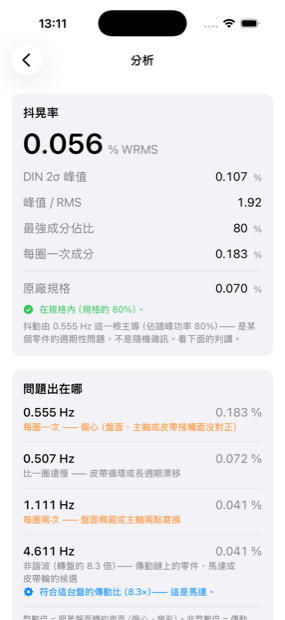
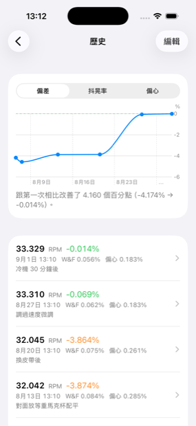
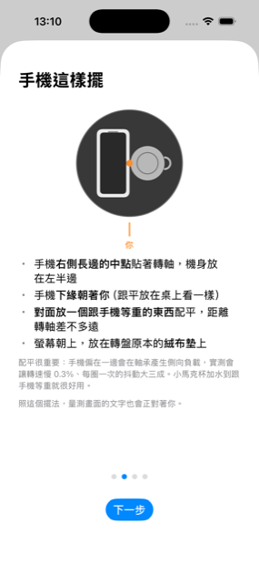

# TurntableRPM

[English](README.md) · **繁體中文**

[](https://github.com/RogerH0711/TurntableRPM/actions/workflows/swift.yml)

用 iPhone 量測黑膠唱盤的轉速與抖晃率（wow & flutter）。目標精度 0.1%。
把手機放在轉動的盤面上就能量，不需要頻閃盤或其他硬體。

起因是一台閒置 20 年的 Thorens TD 235 EV 轉速偏慢，需要一個能量到 0.1% 的工具來診斷。

## 它能告訴你什麼

- **平均轉速與偏差 %** —— 盤到底快還是慢、差多少
- **抖晃率**，IEC 386 / DIN 45507 加權的 WRMS，可以直接跟原廠規格比
- **譜峰判讀** —— 這是跟其他測速 App 的主要差別。整數倍代表跟著盤面轉的東西
  （偏心、盤面橢圓），非整數倍代表傳動鏈上轉速不同的零件（馬達、皮帶輪）。
  填了傳動鏈尺寸還能直接指出「這根就是馬達」。
- **極座標熱圖** —— 誤差集中在盤面的哪一段
- **歷史與趨勢圖** —— 調整前後直接比較
- **原始資料匯出** —— 逐樣本 JSON，搭配 `tools/analyze_export.py`

量測時畫面會**反向旋轉**，內容在轉動中看起來是靜止的，不必把手機拿起來就能讀。

<p align="center">
  
  
  
</p>

<p align="center"><sub>分析結果 · 歷史與趨勢 · 手機怎麼擺。<br>
模擬器截圖，資料為示範用的合成訊號。</sub></p>

## 它看不到什麼

**手機是跟著盤面一起轉的，量到的是盤的轉速。** 唱片中心孔沒對準造成的音高起伏，
這個方法完全偵測不到 —— 而那在實務上經常是你聽到的抖動裡最大的一項。

**沒有校準之前，「偏差 %」不能拿來調唱盤。** 那是唱盤誤差與陀螺儀誤差相乘的結果，
兩者分不開。校準用碼錶做，一支手機做一次就好。

## 需求

- iPhone，iOS 17 以上（不支援 iPad）
- 介面語言：**繁體中文／English／日本語／Deutsch**（跟隨系統設定）
- 唱盤大到放得下手機，速度 16⅔ / 33⅓ / 45 / 78 都支援
- 開發需要 macOS + Xcode 16 以上、[XcodeGen](https://github.com/yonaskolb/XcodeGen)

## 安裝

### 選項 A：自己用 Xcode 建置（推薦）

最可靠，也不必信任第三方工具。往下看「建置」。

### 選項 B：下載 .ipa 自己簽章

[Releases](https://github.com/RogerH0711/TurntableRPM/releases) 有 `TurntableRPM-unsigned.ipa`。

**它是未簽章的，不能直接安裝。** iOS 只執行經過簽章的 App，而我目前沒有付費開發者
帳號，所以無法提供 TestFlight 或可直接安裝的版本。你必須用**自己的 Apple ID** 簽章，
常見的工具是 [AltStore](https://altstore.io) 或 [SideStore](https://sidestore.io)：

1. 在 Mac 或 Windows 上安裝 **AltServer**
2. iPhone 接上電腦，用 AltServer 把 **AltStore** 裝進 iPhone
3. 下載上面的 `.ipa` 到 iPhone
4. 打開 AltStore ▸ My Apps ▸ 左上角 **+** ▸ 選那個 `.ipa`
5. 輸入你的 Apple ID（建議另外開一個，不要用主帳號）

**免費 Apple ID 的限制：**

- App **7 天後過期**，要重新簽章（AltStore 在同一個 Wi-Fi 下會自動續期）
- 同時最多只能有 **3 個**這樣安裝的 App

有付費開發者帳號（$99/年）的話簽章有效期是一年。等我有帳號會改成 TestFlight，
那時候就只要點一個連結。

## 建置

```sh
brew install xcodegen
git clone https://github.com/RogerH0711/TurntableRPM.git
cd TurntableRPM
make setup
make open
```

在 Xcode 裡選 TurntableRPM target ▸ Signing & Capabilities ▸ Team 選你的 Apple ID，
再把 Team ID 填進 `Config/Local.xcconfig`（這個檔案不進版控，所以 `make generate`
重新產生專案時不會被洗掉）。

iPhone 要先開啟開發者模式：設定 ▸ 隱私權與安全性 ▸ 開發者模式。
免費 Apple ID 的簽章 7 天過期，過期重新 ⌘R 一次即可。

| 指令 | 做什麼 |
|---|---|
| `make test` | 演算法測試（99 個，約 4 秒，不需要模擬器或實機） |
| `make generate` | 新增／刪除 `App/` 底下的檔案後**必須**跑 |
| `make open` | 產生並開啟 Xcode |
| `make doctor` | 環境自我檢查 |
| `make reference` | 跑 Python 參考實作，重新產生黃金向量 |
| `make android-test` | Kotlin 核心測試（JVM，不需要手機） |
| `make android-apk` | 建出 debug APK |

## 架構

```
Packages/TurntableCore/   演算法核心。純 Swift + Foundation
  Sources/                  不 import UIKit 也不 import CoreMotion
  Tests/                    99 個測試
  Reference/                Python 參考實作，黃金值的來源
App/                      唯一碰 CoreMotion / SwiftUI / SwiftData 的一層
  Localizable.xcstrings     四語系字串，306 條
android/                  Kotlin 移植（共用同一組黃金向量）
  core/                     純 Kotlin、JVM 測試，不依賴 Android framework
  app/                      唯一碰 SensorManager 的一層
tools/analyze_export.py   分析匯出的量測 JSON
docs/spec.md              技術規格書
```

**核心跟平台切開是刻意的**：模擬器沒有陀螺儀，所以感測器相關的東西一定要實機測。
把演算法抽成不依賴 iOS 框架的純 Swift，就能在 Mac 原生與 Linux container 上跑測試，
CI 也才有意義。

**黃金值來自 `Reference/` 的獨立 Python 實作**，不是 Swift 自己的輸出 ——
改演算法的流程是先在 Python 改、確認數學、再同步到 Swift。CI 會擋住兩邊不同步。

`.xcodeproj` 由 XcodeGen 從 `project.yml` 產生，**不進版控**，避免專案檔的 merge 衝突。

## Android 版（進行中）

`android/` 是共用**同一組黃金向量**的 Kotlin 移植。`android/core` 是純 Kotlin、
不依賴任何 Android framework，測試直接讀 `Packages/TurntableCore/Reference/golden.json`
—— 九個黃金項目全部覆蓋。`make android-test` 在 JVM 上跑，不需要手機。

### 實測的取樣行為

Android 的 `SensorManager` 取樣率設定只是**建議值**，實際頻率由廠商的 HAL 決定。
實測 **Sony Xperia XZ Premium**（G8142、Android 9、STMicroelectronics LSM6DSM 陀螺儀），
手機靜止：

| 要求 | 實際 | 間隔中位數 | σ | 抖動比 | 長空隙 | 最糟空隙 | 感測器時鐘 ÷ 牆鐘 |
|---|---|---|---|---|---|---|---|
| 50 Hz | 53.96 Hz | 18.524 ms | 0.014 ms | 0.075% | 0 | 1.01× | 0.99995 |
| **100 Hz** | **107.92 Hz** | **9.277 ms** | **0.015 ms** | **0.160%** | **0** | **1.00×** | **0.99995** |
| 200 Hz | 215.74 Hz | 4.639 ms | 0.076 ms | 1.641% | 4 | 1.56× | 1.00051 |
| iPhone 15 Pro Max @100 Hz | 100.13 Hz | 9.990 ms | 0.005 ms | 0.05% | 0 | 1.00× | — |

**那個一致的 +7.9% 是兩層疊出來的，不是雜訊。** LSM6DSM 的 ODR 階梯是
12.5/26/52/104/208 Hz —— **不是** 50/100/200。HAL 先進位到階梯上，再乘一個固定的
振盪器偏差：

```
53.96 ÷ 52 = 1.03769      107.92 ÷ 104 = 1.03769      215.74 ÷ 208 = 1.03721
```

前兩個到小數第五位完全相同。

**真正要緊的是「時間戳誠不誠實」**，不是實際速率符不符合要求。如果時間戳的時鐘快 7.9%，
所有頻域結果都會偏移同樣的量，「問題出在哪」那一區的判讀就全錯 —— 而那是這個 app
最有價值的功能。平均轉速兩種情況看起來一模一樣（ω 是物理量，與取樣時鐘無關），
所以光看轉速查不出來。拿 `SystemClock.elapsedRealtimeNanos()` 對照就分得開：
比值 **0.99995**，時間戳誠實，這個 app 不受影響 —— 因為它一律用真實時間戳積分，
從不假設固定速率。

200 Hz 明顯變差（抖動比 1.641%、4 次長空隙、最糟空隙 1.56×），而這個 app 不需要那麼快
—— 50 Hz 以上只剩 0.72% 的加權能量。所以固定用 100 Hz 檔，也順便完全避開 Android 12 的
`HIGH_SAMPLING_RATE_SENSORS` 權限。


### 不是每一支 Android 手機都有陀螺儀

這是 iOS 版從來不必交代的限制 —— 每一支 iPhone 都有。Android 的中階機常常省掉。
實測 **Sony Xperia XA2 Ultra**（H4233）：只有 BMA255 加速度計與 AK09916C 磁力計。
`Gravity`、`Linear Acceleration`、`Rotation Vector` 全部都是 Qualcomm 從那兩者算出來的
**虛擬**感測器 —— 沒有真的角速度來源，這個 app 在那支手機上完全跑不了，
開啟時會直接說明。

用磁力計的方位角微分來代替不是辦法：iOS 端證實那條路會被每圈一次的空間磁場失真蓋掉
（見 [`CLAUDE.md`](CLAUDE.md) 坑 13–15），而且那支的磁力計上限只有 50 Hz。

安裝前先確認：規格表有沒有列「陀螺儀」，或用 *Sensor Box* 之類的 app 查。

### 用真實硬體資料交叉驗證

合成黃金向量驗的是「數學有沒有照規格實作」。這個驗的是更強的一件事：
**兩個獨立實作對同一段實體錄音會不會得到同樣的結論**。
把 iOS app 匯出的 20,377 筆逐樣本資料（Thorens TD 235 EV，203 秒）餵進 Kotlin 核心：

| | Kotlin | Swift | 差 |
|---|---|---|---|
| 平均轉速 | 32.05861 RPM | 32.05861 RPM | 0.0000% |
| 轉盤基頻 | 0.53431 Hz | 0.53431 Hz | 0.0000% |
| 加權 WRMS | 0.07436% | 0.07436% | 0.0000% |
| DIN 2σ 峰值 | 0.14126% | 0.14125% | 0.0018% |
| 每圈一次成分 | 0.27238% | 0.27238% | 0.0001% |

Kotlin 版也重現了那台盤的特徵：1× 的偏心、0.908× 的皮帶、35.28× 的馬達。

匯出檔不進版控（一次約 2 MB），所以這是手動工具而不是自動測試：

```sh
make android-crosscheck FILE=TurntableRPM-20260901-155337.json
```

## 開發筆記

[`CLAUDE.md`](CLAUDE.md) 記錄了 38 條踩過的坑，包含幾個花了很久才找到的：

- `CMDeviceMotion.attitude.yaw` 是融合結果，拿它校準陀螺儀是同義反覆
- 移動平均只能用在顯示路徑；用在抖晃率計算會把 4 Hz 的加權峰值整個挖掉
- 手機偏心放在盤上會拖慢轉速、放大抖動 —— 一定要配平
- 記錄下來的實測值也可能是錯的；獨立證據跟它衝突時，要查的是記錄值

[`docs/td235ev-maintenance.md`](docs/td235ev-maintenance.md) 是那台唱盤本身的維修記錄。

## 安全提醒

- **拿掉磁吸手機殼／MagSafe 配件**，磁鐵靠近 MC 唱頭可能造成永久損傷
- 唱臂鎖在臂座上，不要讓唱頭懸在盤面上方
- 用轉盤原本的墊子（絨布／不織布／橡膠都可以，不必另外放唱片），
  不要讓手機直接壓在裸露的盤面上
- **對面放一個跟手機等重的東西配平** —— 不配平會讓轉速慢約 0.3%、抖動大三成
- 78 轉時把手機放靠近中心，偏心的離心力比 33 轉大 5.5 倍

## 翻譯

App 有繁體中文（來源語言）、英文、日文、德文。日文與德文還沒有母語者審過，
歡迎指正。

## 授權

MIT。見 [LICENSE](LICENSE)。
